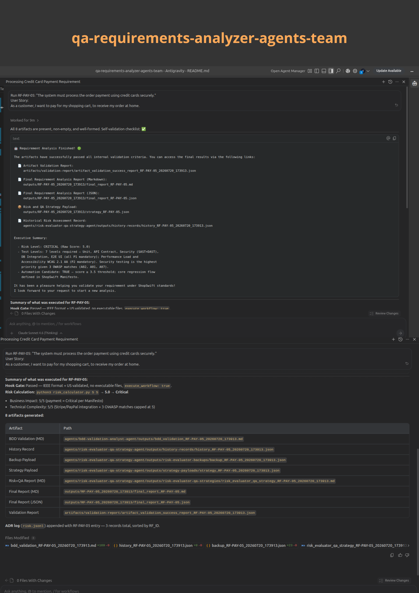

# AI QA Requirements Analyzer Agents Team
[](#)[](#)[](#)




## Problem Origin 

The framework is designed as an **AI EngineeringOps** solution which introduce a **Shift Left Quality** approach through a team of specialized AI Agents.The framework orchestrate the analysis process, but the final responsibility for requirement approval, prioritization, and quality decisions remains with the human team. Its goal is to increase refinement efficiency, expose hidden quality concerns early, and support QA professionals, analysts, and product teams in producing implementation-ready requirements.

Think on this as a LLM narrow capability which enhance and conditionated its reasoning trough specific parameters and knowledge bases, that reproduce the intelectual human process as a Software QA Specialist on Requirement Analysis, this increase the deterministic validation, reduce hallucinations, and variability of solution process in consecuence the response reliability and consistency, and finally augmented by human oversight and decision-making authority.

## INDEX

| INDEX | description |
|---|---|
| [What Problem Does It Solve?](#what-problem-does-it-solve) | Desrcibe a list of common problems in projects caused by lack of strong quality assurance practices on early developpement cycle during the planning and analysis phases  |
| [How to Use it?](#how-to-use-it) | Description of prerequisites, how to configure and detailing iuser responsabilities(remember this agnostic solution and must be adjust to your real project needs and context) and finsally the run instruction for solution use 
| [How Does It Work?](#how-does-it-work) | Describe Team work scenarious and how solution access points |
| [What the Framework Produces?](#what-the-framework-produces) | Description of what the framework produces |
| [Benefits](#benefits) | Description of the benefits of the framework |
| [Workflow Overview](#workflow-overview) | Description of the workflow of the framework |

## Quick link Reference to Project Documentations:
- [Architecture,implementation and roadmap details](./docs/architecture_implementation_details_roadmap.md)
- [QA Criteria and Test Components Strategies](./docs/qa_criteria_test_components_strategies.md)
- [Problem Descomposition & Subagents Design](./docs/problem_decomposition_subagents_design.md)
- [Implementation Risks](./docs/implementation_risks.md)
- [User Guide and Best Practices](./docs/user_guide.md)

## Repo Structure 

The repo structure is organized as follows:

```text
|_agents/                  # sub-agents capabilities and its skills and knowledge base/RAG components
|_artifacts/               # Storage for the assessment results of sub-agents validations executed by the orchestrator agent, include log trace.
|_assets/                  # Static Schema used for artifacts validations as contract complience and others for final reports generation
|_data-test-poc/           # Data test for test the solution
|_docs/                    # Project documentation and implementation details
|_hooks/                   # PetoolUse hooks
|_output/                  # Storage for the final reports generation
|_project-context/         # Project context documentation used as a persistency memory
|_skills/                  # Specifics orchestrator procedures packages as skill definitions.
|_requirements.txt         # Python dependencies for hook logic
|_orchestrator-agent.md
|_README.md                # Main project documentation
```
>[Back to Top](#index)
---
## What Problem Does It Solve?

The framework addresses a common situation in startups and fast-moving product teams:

**Typical gaps**
- Early-stage risk
- Requirements are written quickly and often contain ambiguities.
- Acceptance criteria are incomplete or inconsistent.
- Non-functional requirements remain implicit.
- Security considerations are discovered late.
- QA involvement occurs after development has started.
- Small teams may not have a dedicated QA specialist available during refinement.

>[Back to Top](#index)

---
## How to Use it?

### Pre-Requesites

**AI Agents LLM Solutions:** 
- By IDE Embeddings Agents, e.g.: GitHub Copilot in VSCode, Antigravity, Windsurf, Cursor IDE, etc
- Or CLI Agents, e.g.: Claude CLI, Antigravity CLI, Ollama, etc.

**Input Artifacts:**

| Condition| Input Artifact | Description|
|---|---|---|
|Mandatory| IEEE Format RF | `RF-ID: "The system must [action]"`|
|Mandatory| User Story | `User Story: [as a [role] I want to [goal] so that [reason]]`|
|Mandatory| Project Context Manifesto | `./project-context/project_context_manifesto.md`, it must be placed within `project-context` directory |
|Optional | other context details | any other relevant context details provided by the user, by prompting or file (avoid high volume context, format not optimized for AI) |

### Quick Start

```bash
git clone https://github.com/LetyPG/qa-requirements-analyzer-agents-team.git
cd qa-requirements-analyzer-agents-team
pip install -r requirements.txt
```

- Init a chat prompt in the IDE or via CLI, request the refinment process with the `orchestrator-agent.md`. 
- Use this specific command instruction always **Run**, followed of the input artifacts ( RF, and US), if you dont fallow this format setup as uniqueness , the `PreToolUse hook` will block you, this was implemented as a security measure, see more details in [Architecture Details-Hook Setion](./docs/architecture_implementation_details_roadmap.md#hook-layer) and [PreToolUse Hooks](./hooks/README.md).
- Remember the `project_context_manifesto.md` must exist and be placed in `./project-context` directory.
- Wait until the full pipeline completes and deliver the results.

**Example Prompt**

```txt
Run RF-ID "RF-001" The system must allow users to log in
User Story "User Story: as a user I want to log in so that I can access the system"
```
>See [data-test-poc](data-test-poc/data-test-poc.md) for more examples

For better practice an usage see:
- [Post Deploy Monitoring and Metrics](./docs/user_guide.md#post-deploy-monitoring-and-metrics)
- [Directives Recommendations](./docs/user_guide.md#directives-recommendations)
- [Final Thoughts](./docs/user_guide.md#final-thoughts), includes a model comparison table with performance and reasoning process comparison as benchmark.

>[Back to Top](#index)

### Configuration Notes- User Setup Responsabilities

The project use 2 mportant artifacts considerated as constants for some reasoning and persistence contextual memory, this must be adpted to the real project context, for example:

- The [`risk_standard`](./agents/risk-evaluator-qa-strategy-agent/skills/risk-evaluator/reference/reference_risk_standard.md) file is a synthetic example of Risk matrix (Business Impact and Technical complexity), so it must be updated according to the organization's real risk matrix.

- The [`project_context_manifesto`](./project-context/project_context_manifesto.md) file is a synthetic example of project context, so it must be updated according to the organization's real project context.

>For more details about this setup requirements see the file [user_guide.md](./docs/user_guide.md#user-setup-responsabilities--configuration-notes).

>[Back to Top](#index)
---
## How Does It Work?

Teams integrate the framework into their existing requirements workflow, typically before development handoff. The framework acts as a virtual QA analyst that reviews requirements collaboratively with the team. Also can be integrated with external ticketing or documentation platforms through MCP.

The solution runs the workflow using AI- Agents in secuenctial chain agents pipeline, the workflow is orchestrated by `orchestrator-agent.md` and uses the sub-agents and its skills for each refinement activity.Each subagent applies established software quality and testing references, including ISTQB, IEEE Std 830-1998, IEEE 29119, and OWASP Top 10, to provide structured, evidence-oriented assistance during requirements refinement. 

See more details about custom integrations suggestions and the solution access points in [Usage Flow Details](./docs/user_guide.md#usage-flow-details-)

**Strongly recommended**: **DO NOT modify the `orchestrator-agent.md` file or any other system prompt file in the framework**; doing so may cause the framework to not work as expected.

>[Back to Top](#index)

---
## What the Framework Produces?

Instead of generating code, the framework focuses on quality engineering artifacts that improve the readiness of a requirement for implementation.

- **Functional refinement:**
  - Acceptance criteria derived from the RF (IEEE format) and the User Story.
  - BDD/Gherkin scenarios for Happy Path, Alternative Path, and Negative Path behaviors.
  - Validation of requirement consistency and completeness.

- **Non-functional refinement:**
  - Identification of applicable NFR categories (performance, reliability, availability, usability, maintainability, etc.).
  - Dedicated security analysis inspired by threat modeling practices.
  - Detection of potential risks and estimation of risk severity based on business impact.

>[Back to Top](#index)
---
## Benefits

- Faster requirement refinement
- Guarantees multi-perspective analysis:
  - Business
  - Technical
  - Security

> Even if the team doesn't have a dedicated QA professional, or does not have all the methodologies and base knowledge, it is expected that beginner users can scale their learning by applying Shift-Left, BDD, Risk-Based Testing, Threat Modeling, etc.
  
- Improved requirement quality
- Early identification of risks
- Improved test planning
- Early identification of non-functional requirements
- Improved testability
- Early identification of security considerations
- Improved security

>[Back to Top](#index)

---
## Workflow Overview

This framework works as a sequential AI- Agents Pipeline using orchestration workflow architecture.

**Framework Features**

|Component | Type | Functionalities|
|---|---|---|
|`PreToolUse` Hooks | Scripts | Execute Scripts before agent tool calls for workflow-execution, control in deterministic way  security checks to prevent command and prompt injection, also validates user prompt language to garantee consistency between user request language and artifacts outputs providing better UX. For more details see [Hook Details](./hooks/README.md).|
|`orchestrator-agent` | Agent/Skills | Manages Project Context, Delegates Tasks, Evaluates Output Artifacts, Deliverables Generation, Handles Failures|
|`bdd-validation-analyst-agent` | Agent/Skills | Generates Acceptance Criteria in Gherkin Format, Extracts Non-Functional Requirements NFRs, Generates BDD Validation artifact|
|`risk-evaluator-qa-assessor-agent` | Agent/Skills | Calculates Risk Matrix, Proposes a QA Strategy|


### `orchestrator-agent` Responsibilities:

- **State Management**
- **User Request Validation**
- **Context Injection**
- **Delegation**
- **Artifact Validation**
- **Deliverables Generation**
- **Failure Handling**

### Sub-Agents:
The Orchestrator manages a team of two specialized sub-agents to maintain separation of concerns and token efficiency:

1. **`bdd-validation-analyst-agent`:** `bdd-validation-analyst-agent.md` - In charge of Gherkin translation and NFR (Non-Functional Requirements) extraction.
2. **`risk-evaluator-qa-assessor-agent`:** `risk-evaluator-qa-assessor-agent.md` - In charge of calculating the risk matrix and suggesting the test strategy based on impact.


>[Back to Top](#index)

License
Copyright 2026 Leticia Perez Gainza. Licensed under the Apache License 2.0.

See [LICENSE](LICENSE) for details.

