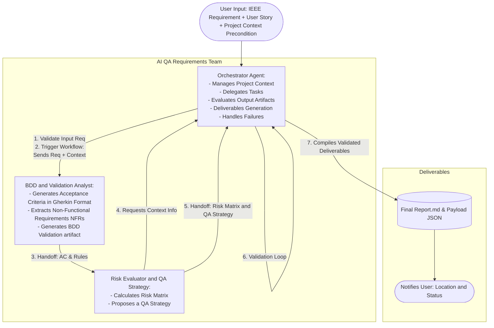

# AI QA Requirements Analyzer Agents Team
[](#)[](#)[](#)


## Problem Origin 

In a consulting scenario, I worked with a startup that needed stronger quality assurance practices but did not have a dedicated QA professional. To address this gap, I developed a solution to improve requirements before development begins, this was concibe as a Shift-Left Quality approach, which directly impacts on the Software Development Life Cycle (SDLC) and the Testing Development Life Cycle (TDLC). 
This framework analyzes functional requirements written in IEEE-style RF format together with User Stories, derives acceptance criteria, generates BDD/Gherkin scenarios, identifies applicable non-functional requirements, performs security-oriented analysis inspired by threat modeling, estimates business-impact risks, and recommends a risk-based testing strategy.

Each subagent applies established software quality and testing references, including ISTQB, IEEE Std 830-1998, IEEE 29119, and OWASP Top 10, to provide structured, evidence-oriented assistance during requirements refinement.

The framework is designed as an **AI EngineeringOps** solution: 
AI agents orchestrate the analysis process, but the final responsibility for requirement approval, prioritization, and quality decisions remains with the human team. Its goal is to increase refinement efficiency, expose hidden quality concerns early, and support QA professionals, analysts, and product teams in producing implementation-ready requirements.

## Quick link Reference

- [What Problem Does It Solve?](#what-problem-does-it-solve)
- [How Does It Work?](#how-does-it-work)
- [Pre-Requesites](#pre-requesites)
- [How to Use it?](#how-to-use-it)
- [What the Framework Produces?](#what-the-framework-produces)
- [Benefits](#benefits)
- [Workflow Overview](#workflow-overview)

## Quick link Reference in project files detailed documentations:
- [Architecture,implementation and roadmap details](./docs/architecture_implementation_details_roadmap.md)
- [QA Criteria and Test Components Strategies](./docs/qa_criteria_test_components_strategies.md)
- [Problem Descomposition & Subagents Design](./docs/problem_decomposition_subagents_design.md)
- [Implementation Risks](./docs/implementation_risks.md)

## Repo Structure 

The repo structure is organized as follows:

```text
|_agents/                  # LLM agents, skills and RAG components
|_artifacts/               # Storage for the assessment results of sub-agents validations executed by the orchestrator agent, include log trace.
|_assets/                  # Static Schema used for artifacts validations as contract complience and others for final reports generation
|_data-test-poc/           # Data test for test thev solution
|_docs/                    # Project documentation and implementation details
|_hooks/                   # PetoolUse hooks
|_output/                  # Storage for the final reports generation
|_project-context/         # Project context documentation used as a persistency memory
|_skills/                  # Specifics orchestrator procedures packages as skill definitions.
|_requirements.txt         # Python dependencies for hook logic
|_orchestrator-agent.md
|_README.md                # Main project documentation
```

## What Problem Does It Solve?

The framework addresses a common situation in startups and fast-moving product teams:

**Typical gaps**
- Early-stage risk
- Requirements are written quickly and often contain ambiguities.
- Acceptance criteria are incomplete or inconsistent.
- Non-functional requirements remain implicit.
- Security considerations are discovered late.
- QA involvement occurs after development has started.
- Small teams may not have a dedicated QA specialist available during refinement.

>[Back to Top](#quick-link-reference)

---
## How Does It Work?

Teams integrate the framework into their existing requirements workflow, typically before development handoff. The framework acts as a virtual QA analyst that reviews requirements collaboratively with the team.
The solution is acceced trought:
- IDEs Interface with AI Agents Embeddings
- CLI Agents 
- As a Roadmap will be added a dedicated Web Interface to track the runtime pipeline and results.

## Pre-Requesites

| Condition| Input Artifact | Description|
|---|---|---|
|Mandatory| IEEE Format RF | `RF-ID: "The system must [action]"`|
|Mandatory| User Story | `User Story: [as a [role] I want to [goal] so that [reason]]`|
|Mandatory| Project Context Manifesto | `./project-context/project_context_manifesto.md`, it must be placed within `project-context` directory |
|Optional | other context details | any other relevant context details provided by the user, by prompting or file (avoid high volume context, format not optimized for AI) |

### Configuration Notes- User Setup Responsabilities

It is recomended edit 2 main contextual a resoning files acording with your projects real deails:

1. `./project-context/project_context_manifesto.md`

Currently system use a sytethic context manifesto, but the idea is :
- Edit in `project-context/project_context_manifesto.md` this file and add your project context and business rules, to make the system contextually aware of your project.
- Or create a new file `context-manifesto-user-guidance` that will, in case you need request guidance and the system will help you to create this file

| Condition|   System  Action |
|---|---|
|Missing `context-manifesto-user-guidance` | The orchestrator triggers a guided process to help the user create the file |

2. `./agents/risk-evaluator-qa-strategy-agent/skills/risk-evaluator/reference/reference_risk_standard.md`

This file contains the Risk Evaluation standard used by the Risk Evaluator agent. It is a reference file that the agent uses to evaluate the risks of the requirements.
Currently the refrence point to:
- Business Impact Matrix (Scale 1-5), represents business impact details
   - It is recomended keep the scale to avoid several change in other solutions parts such as the script `risk_calculator.py` and others.
   - Edit only the description, impacts ext. Avoid edit the scale values.

- Technical Complexity Matrix (Scale 1-5), represents technological stack details.
   - It is recomended keep the scale to avoid several change in other solutions parts such as the script `risk_calculator.py` and others.
   - Edit only the technological croterion with your project details.
>For more details of this setup needs see the file [implementation_risks.md](./docs/implementation_risks.md), on risk R2, R3 and R9. 


>[Back to Top](#quick-link-reference)

---
## How to Use it?

**Quick Start**
```bash
git clone https://github.com/LetyPG/ai-qa-requirements-analyzer-agents-team.git
cd ai-qa-requirements-analyzer-agents-team
pip install -r requirements.txt
```

- Init a chat prompt in the IDE or via CLI, request or ask the execution of the framework with the orchestrator-agent. Or request requirements refinement process with the orchestrator-agent.
- Pass as an input the RF and the User Story you want to analyze.
- Remember the `project_context_manifesto.md` must exist and be placed at project root level
- Wait until the full pipeline completes and deliver the results.

**Example Prompt**

```txt
Requesting requirements refinement for RF-ID "RF-001" The system must allow users to log in
User Story "User Story: as a user I want to log in so that I can access the system"
```

- See [data-test-poc](data-test-poc/data-test-poc.md) for more examples

>[Back to Top](#quick-link-reference)
---
## What the Framework Produces?

Instead of generating code, the framework focuses on quality engineering artifacts that improve the readiness of a requirement for implementation.

- **Functional refinement:**
  - Acceptance criteria derived from the RF (IEEE format) and the User Story.
  - BDD/Gherkin scenarios for Happy Path, Alternative Path, and Negative Path behaviors.
  - Validation of requirement consistency and completeness.

- **Non-functional refinement:**
  - Identification of applicable NFR categories (performance, reliability, availability, usability, maintainability, etc.).
  - Dedicated security analysis inspired by threat modeling practices.
  - Detection of potential risks and estimation of risk severity based on business impact.

>[Back to Top](#quick-link-reference)
---
## Benefits

- Faster requirement refinement
- Guarantees multi-perspective analysis:
  - Business
  - Technical
  - Security

> Even if the team doesn't have a dedicated QA professional, or does not have all the methodologies and base knowledge, it is expected that beginner users can scale their learning by applying Shift-Left, BDD, Risk-Based Testing, Threat Modeling, etc.
  
- Improved requirement quality
- Early identification of risks
- Improved test planning
- Early identification of non-functional requirements
- Improved testability
- Early identification of security considerations
- Improved security

>[Back to Top](#quick-link-reference)
---


---
## Workflow Overview

### Orchestrator Agent Responsibilities:
- **State Management**
- **User Request Validation**
- **Context Injection**
- **Delegation**
- **Artifact Validation**
- **Deliverables Generation**
- **Failure Handling**

### Sub-Agents:
The Orchestrator manages a team of two specialized sub-agents to maintain separation of concerns and token efficiency:

1. **BDD & Validation Analyst:** `bdd-validation-analyst-agent.md` - In charge of Gherkin translation and NFR (Non-Functional Requirements) extraction.
2. **Risk & Strategy Assessor:** `risk-evaluator-qa-assessor-agent.md` - In charge of calculating the risk matrix and suggesting the test strategy based on impact.




>[Back to Top](#quick-link-reference)
---


License
Copyright 2026 Leticia Perez Gainza. Licensed under the Apache License 2.0.

See [LICENSE](LICENSE) for details.

