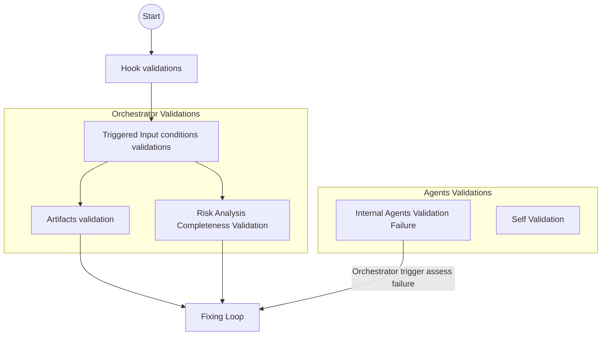

# Quick link Reference

- [QA Criteria: Validation and Verification Strategy](#qa-criteria-validation-and-verification-strategy)
- [Component Test Strategy](#component-test-strategy)
- [Test Runner Guide](#test-runner-guide)
- [Skill Test Strategy-Roadmap](#skill-test-strategy-roadmap)


## QA Criteria: Validation and Verification Strategy

The validation strategy on this framework includes 4 different layers:

1. Hook Layer Validations (Security and Language Detection Agent PreToolUse)
2. Self validations (every component : agents and skills validates the task completetion and qa criteria acomplishment)
3. Artifact validation (orchestrator qa gates in input and output artifacts)
4. Risk analysis completeness validation (high impact on solution usabillity goals)
5. Internal agents validation failure (bidireccional)



>[Back to Top](#quick-link-reference)

---

## Component Test Strategy

The hook layer is the only deterministic Python component in this framework. Its test suite validates that security and language logic behave correctly before any LLM reasoning takes place. Failures here have the highest impact: a missed block or a wrong language rule propagates silently into all downstream agent outputs.

### Test Architecture

The suite follows a three-layer structure aligned with Single Responsibility:

```
hooks/tests/
├── conftest.py          # sys.path injection shared by all test files
├── __init__.py          # package marker
├── test_security.py     # Unit — security gate + contract structures
├── test_language.py     # Unit — language detection + result builder
└── test_integration.py  # Integration — hook as a subprocess black box
```

**Separation principle:**
- Unit tests call internal functions directly. No subprocess. No real filesystem I/O (mocked where needed).
- Integration tests treat the hook as a black box: JSON in via stdin, JSON out via stdout. No internal functions are referenced.

---

### Test File Responsibilities and Validation Criteria

#### `test_security.py` — Security Gate Unit Tests

**Responsibility:** Validate all security-related functions in isolation.

| Test Class | Component Under Test | What is Validated |
|---|---|---|
| `TestHookContract` | `HookResult`, `HookContext`, `HookExtensions` | Optional fields default to `None`; `to_dict()` always emits all keys; mandatory fields (`execute_workflow`, `trace_id`) always present |
| `TestCheckExtension` | `_check_extension()` | Blocked: `.exe`, `.sh`, `.py`, `.dll`, `.docm`; Allowed: `.md`, `.pdf`, `.txt`, no-extension; Compound `.pdf.exe` is blocked; Safe `.tar.gz` is allowed; `.py` becomes allowed when overridden via `HookExtensions` |
| `TestCheckFileSize` | `_check_file_size()` | File over 10 MB → blocked with `"exceeds"` in reason; file under limit → `None`; non-existent file → skipped gracefully |
| `TestRunSecurityGate` | `run_security_gate()` | No files → passes; blocked extension → `execute_workflow=False`, `risk_level="high"`; compound extension → blocked; safe `.md` → passes when MIME/size checks are mocked; `trace_id` on blocked result is a valid UUID4; first bad file in a list triggers abort |

**Validation criteria:**
- All blocked paths must return a `HookResult` with `execute_workflow=False`.
- All allowed paths must return `None` (gate passes).
- `trace_id` on every block result must be a well-formed UUID4 string.
- No real filesystem access occurs (patched via `unittest.mock`).

---

#### `test_language.py` — Language Detection Unit Tests

**Responsibility:** Validate all language-related functions in isolation.

| Test Class | Component Under Test | What is Validated |
|---|---|---|
| `TestDetectLanguage` | `_detect_language()` | Correct detection of Spanish, English, French, Portuguese, German, Italian with `confidence >= 0.75`; empty prompt → English fallback, `confidence=0.0`; whitespace-only → English fallback; confidence below threshold → English fallback with raw score preserved |
| `TestBuildLanguageResult` | `build_language_result()` | Returns `execute_workflow=True`; `language_rule` is populated and non-empty; `sanitized_context` contains both `user_prompt` and `input_files`; `trace_id` is passed through unchanged; Spanish input → rule references "Spanish" |

**Validation criteria:**
- Detection must meet the 0.75 confidence threshold for all six supported languages.
- When confidence falls below 0.75, fallback language must be English and the raw score must be preserved in the result for diagnostics.
- No subprocess is spawned. External library (`lingua`) is used directly or mocked for edge cases.

---

#### `test_integration.py` — Hook Process Integration Tests

**Responsibility:** Validate the hook as a complete running process, simulating the exact execution model of the Claude / Antigravity `PreToolUse` agent runtime.

Each test spawns the hook as a subprocess, passes JSON on stdin, and asserts on the JSON emitted to stdout. No internal functions are called directly — the hook is treated as a black box.

| Test | Scenario | Expected Result |
|---|---|---|
| `test_blocked_exe_file_returns_execute_workflow_false` | `.exe` file in `tool_input` | `execute_workflow=false`, `risk_level="high"`, `block_reason` present, `trace_id` present |
| `test_compound_extension_pdf_exe_is_blocked` | `.pdf.exe` double extension | `execute_workflow=false` |
| `test_clean_md_request_returns_execute_workflow_true` | `.md` file, English prompt | `execute_workflow=true`, `trace_id` present |
| `test_empty_stdin_returns_execute_workflow_true` | Empty stdin | Exit code 0, `execute_workflow=true` |
| `test_invalid_json_stdin_returns_execute_workflow_true` | Malformed JSON stdin | Exit code 0, `execute_workflow=true` |
| `test_stdout_contains_mandatory_keys` | Any valid request | `execute_workflow` and `trace_id` always present in output |
| `test_spanish_prompt_does_not_crash_hook` | Spanish-language prompt | `execute_workflow=true`, `trace_id` present, no crash |
| `test_exit_code_is_always_zero_even_when_blocked` | `.bat` file blocked | Exit code 0 even when `execute_workflow=false` |

**Validation criteria:**
- Exit code must always be `0`. A non-zero exit would crash the agent session.
- Every response must be valid JSON with `execute_workflow` and `trace_id` keys.
- Blocked requests must return `execute_workflow=false` — never silently allow a dangerous file type.
- The hook must not crash on empty, malformed, or unexpected stdin.

---

## Test Runner Guide

### **Environment Setup**

The hook test suite runs inside a dedicated virtual environment (`hooks/.venv/`) that isolates the hook dependencies — `lingua-language-detector` and `python-magic` — from the rest of the project.

All commands are run from **inside the `hooks/` directory** with the `hooks/.venv` activated.

**Activate the venv (required before any test command):**
```bash
cd hooks/
source .venv/bin/activate
```

> **System dependency** for MIME detection (optional but recommended):
> ```bash
> sudo apt-get install libmagic1   # Debian / Ubuntu
> brew install libmagic             # macOS
> ```

### **Test Execution Commands**

**Run the full suite (all 48 tests):**
```bash
python -m pytest tests/ -v
```

**Run security unit tests only:**
```bash
python -m pytest tests/test_security.py -v
```

**Run language unit tests only:**
```bash
python -m pytest tests/test_language.py -v
```

**Run integration tests only:**
```bash
python -m pytest tests/test_integration.py -v
```

**Run with short traceback (CI-friendly):**
```bash
python -m pytest tests/ --tb=short
```

**Test Count Summary**

| File | Type | Tests | Scope |
|---|---|---|---|
| `test_security.py` | Unit | 26 | Contract data structures + security gate functions |
| `test_language.py` | Unit | 14 | Language detection + result builder |
| `test_integration.py` | Integration | 8 | Hook subprocess stdin → stdout |
| **Total** | | **48** | |

> [Back to Top](#quick-link-reference)

## Skill Test Strategy Roadmap

As the framework evolves, the following key capabilities will be introduced to enhance its self-improving nature and evaluation accuracy:

### Evaluation Feature
A dedicated framework capability to measure the deterministic quality of the agents' outputs over time. This evaluation feature will benchmark generated artifacts (BDD scenarios, risk matrices, and NFR extractions) against a curated dataset of known-good requirements ("Golden Path"). It will provide objective scoring (e.g., accuracy, completeness, formatting strictness) and track performance across different LLM models and agent prompt iterations.
This will be implemented in a new directory ./framework-capabilities/
This functionality will be implemented using the following agent:

**Outside Reviewer Dedicated Agent**
Introduction of a new specialized agent that acts as an independent auditor, it will use the `evals/eval.json` file to benchmark the generated artifacts. Its main responsibilities will be:

- **Audit & Validate:** Continuously review the outputs produced by the Orchestrator and other sub-agents to detect subtle hallucinations, logical inconsistencies, or deviations from industry standards (ISTQB, IEEE) that basic schema validation might miss.
- **Skill Improvement:** Provide continuous feedback to the agent prompt structures, essentially acting as an automated "Agent Trainer." It will suggest prompt refinements, updated compliance references, or adjustments to validation rules to improve the overall team's skills iteratively.

>[Back to Top](#quick-link-reference)