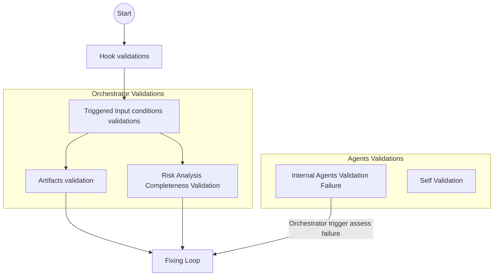

# Quick Link Reference

This document describes the testing strategies for the QA Criteria Validation and Verification components of the Requirements Analyzer agents. It includes details on the hook layer, the validation and verification strategy, the test runner guide, and the skill test strategy roadmap.

## INDEX 

|Index | Description|
|---|---|
| [QA Criteria: Validation and Verification Strategy](#qa-criteria-validation-and-verification-strategy) | The 5 layer validation strategy on this framework |
| [Component Test Strategy](#component-test-strategy) | The hook layer is the only deterministic Python component in this framework. Its test suite validates that security and language logic behave correctly before any LLM reasoning takes place. Failures here have the highest impact: a missed block or a wrong language rule propagates silently into all downstream agent outputs.|
| [Test Runner Guide](#test-runner-guide) | how to run all the components tests |
| [Skill Test Strategy-Roadmap](#skill-test-strategy-roadmap) | Describe the next auto validation feature of the framework as roadmap, which is the external validation engine for the skills using *LLMs Models Judge* and `evals`. |
 

## QA Criteria: Validation and Verification Strategy

The main goal of this framework is to guarantee the quality of the requirements  refinement process, for that reason the framework use the principle of **"Quality Before Process"**, this means that the framework itself applies its own validation criteria to its components and workflows to guarantee its proper functioning and ensure the system reliability and requirements quality outcomes.

The validation strategy on this framework includes 5 different layers:

1. Hook Layer Validations (Security and Language Detection Agent PreToolUse)
2. Self validations (every component : agents and skills validates the task completion and qa criteria accomplishment)
3. Artifact validation (orchestrator qa gates in input and output artifacts)
4. Risk analysis completeness validation (high impact on solution usability goals)
5. Internal agents validation failure (bidirectional)



>[Back to Top](#index)

---

## Component Test Strategy

As part of maintaining the **"Quality Before Process"** principle, the framework includes a component testing layer.
All deterministic components within this framework are tested using **pytest** as the test runner, and **ruff** for code linting and styling.

### Skills Test layer

This is a dedicated layer that apply the **Open to extension but close to modification** principle for future LLMs integration, where each skill is implemented as a Python class and must be tested using pytest and must follow the same test structure.

The test structure follows the same structure as the hook layer, with a clear separation of concerns and a focus on deterministic testing.

As practical implementation each skill deterministic tool, utility or scripting must include its own unit tests and must follow the same test structure also use the same linting tool and python test runner.

#### Risk Calculator Skill Test Architecture

Currently the `risk-evaluator` skill within `risk-evaluator-qa-strategy-agent` uses a deterministic script for risk logic calculation.
To validate the unit level component, the test spec `test_risk_calculator.py` was created.
The validation and verification specifications:

- **Input Validation (`TestInputValidation`)**: Enforces the 1.0–5.0 scale boundaries for both Impact and Complexity inputs, asserting that `ValueError` is raised for out-of-bound values.
- **Formula Precision (`TestScoreComputation`)**: Validates the weighted formula `(Impact × 0.70) + (Complexity × 0.30)` and 2-decimal rounding across key boundary scores.
- **Severity Classification (`TestSeverityClassification`)**: Verifies exact score threshold transitions (`Critical` ≥ 4.5, `High` ≥ 3.5, `Medium` ≥ 2.5, `Low` ≥ 1.0).
- **Public API Contract (`TestPublicAPIContract`)**: Ensures `calculate_risk()` returns the expected dictionary contract schema (`raw_score`, `severity_level`, `status`).
- **CLI Subprocess Integration (`TestCLIIntegration`)**: Validates command-line execution via `subprocess.run`, confirming correct JSON stdout formatting for both success and error outputs.

>[Back to Top](#index)

### Hook Layer Test Architecture

The hook layer is a deterministic Python component in this framework. Its test suite validates that security and language logic behave correctly before any LLM reasoning takes place. Failures here have the highest impact: a missed block or a wrong language rule propagates silently into all downstream agent outputs.

The suite follows a three-layer structure aligned with Single Responsibility:

```
hooks/
├── conftest.py           # sys.path injection shared by all test files
├── hook_contract.py      # Data contracts — HookContext, HookResult, HookExtensions
├── security_gate.py      # File/MIME/size validation + prompt injection guard
├── language_detector.py  # Offline language detection via lingua + LANGUAGE_RULES
├── security_language.py  # PreToolUse entrypoint — orchestrates the two phases above
```

**Source module mapping:**
- `test_security.py` imports from `hooks.security_gate`
- `test_language.py` imports from `hooks.language_detector`
- `test_integration.py` invokes `security_language.py` as a subprocess — no internal imports

**Separation principle:**
- Unit tests call internal functions directly. No subprocess. No real filesystem I/O (mocked where needed).
- Integration tests treat the hook as a black box: JSON in via stdin, JSON out via stdout. No internal functions are referenced.

>[Back to Top](#index)

---

#### Test File Responsibilities and Validation Criteria

##### `test_security.py` — Security Gate Unit Tests

**Responsibility:** Validate all security-related functions in isolation.

| Test Class | Component Under Test | What is Validated |
|---|---|---|
| `TestHookContract` | `HookResult`, `HookContext`, `HookExtensions` | Optional fields default to `None`; `to_dict()` always emits all keys; mandatory fields (`execute_workflow`, `trace_id`) always present |
| `TestCheckExtension` | `_check_extension()` | Blocked: `.exe`, `.sh`, `.py`, `.dll`, `.docm`; Allowed: `.md`, `.pdf`, `.txt`, no-extension; Compound `.pdf.exe` is blocked; Safe `.tar.gz` is allowed; `.py` becomes allowed when overridden via `HookExtensions` |
| `TestCheckFileSize` | `_check_file_size()` | File over 10 MB → blocked with `"exceeds"` in reason; file under limit → `None`; non-existent file → skipped gracefully |
| `TestRunSecurityGate` | `run_security_gate()` | No files → passes; blocked extension → `execute_workflow=False`, `risk_level="high"`; compound extension → blocked; safe `.md` → passes when MIME/size checks are mocked; `trace_id` on blocked result is a valid UUID4; first bad file in a list triggers abort |

**Validation criteria:**
- All blocked paths must return a `HookResult` with `execute_workflow=False`.
- All allowed paths must return `None` (gate passes).
- `trace_id` on every block result must be a well-formed UUID4 string.
- No real filesystem access occurs (patched via `unittest.mock`).

>[Back to Top](#index)

#### `test_language.py` — Language Detection Unit Tests

**Responsibility:** Validate all language-related functions in isolation.

| Test Class | Component Under Test | What is Validated |
|---|---|---|
| `TestDetectLanguage` | `_detect_language()` | Correct detection of Spanish, English, French, Portuguese, German, Italian with `confidence >= 0.75`; empty prompt → English fallback, `confidence=0.0`; whitespace-only → English fallback; confidence below threshold → English fallback with raw score preserved |
| `TestBuildLanguageResult` | `build_language_result()` | Returns `execute_workflow=True`; `language_rule` is populated and non-empty; `sanitized_context` contains both `user_prompt` and `input_files`; `trace_id` is passed through unchanged; Spanish input → rule references "Spanish" |

**Validation criteria:**
- Detection must meet the 0.75 confidence threshold for all six supported languages.
- When confidence falls below 0.75, fallback language must be English and the raw score must be preserved in the result for diagnostics.
- No subprocess is spawned. External library (`lingua`) is used directly or mocked for edge cases.

>[Back to Top](#index)
---

#### `test_integration.py` — Hook Process Integration Tests

**Responsibility:** Validate the hook as a complete running process, simulating the exact execution model of the Claude / Antigravity `PreToolUse` agent runtime.

Each test spawns the hook as a subprocess, passes JSON on stdin, and asserts on the JSON emitted to stdout. No internal functions are called directly — the hook is treated as a black box.

| Test | Scenario | Expected Result |
|---|---|---|
| `test_blocked_exe_file_returns_execute_workflow_false` | `.exe` file in `tool_input` | `execute_workflow=false`, `risk_level="high"`, `block_reason` present, `trace_id` present |
| `test_compound_extension_pdf_exe_is_blocked` | `.pdf.exe` double extension | `execute_workflow=false` |
| `test_clean_md_request_returns_execute_workflow_true` | `.md` file, English prompt | `execute_workflow=true`, `trace_id` present |
| `test_empty_stdin_returns_execute_workflow_false` | Empty stdin | Exit code 0, `execute_workflow=false` (prompt injection gate blocks missing prompt) |
| `test_invalid_json_stdin_returns_execute_workflow_false` | Malformed JSON stdin | Exit code 0, `execute_workflow=false` (prompt injection gate blocks missing prompt) |
| `test_stdout_contains_mandatory_keys` | Any valid request | `execute_workflow` and `trace_id` always present in output |
| `test_spanish_prompt_does_not_crash_hook` | Spanish-language prompt | `execute_workflow=true`, `trace_id` present, no crash |
| `test_exit_code_is_always_zero_even_when_blocked` | `.bat` file blocked | Exit code 0 even when `execute_workflow=false` |

**Validation criteria:**
- Exit code must always be `0`. A non-zero exit would crash the agent session.
- Every response must be valid JSON with `execute_workflow` and `trace_id` keys.
- Blocked requests must return `execute_workflow=false` — never silently allow a dangerous file type.
- The hook must not crash on empty, malformed, or unexpected stdin.

>[Back to Top](#index)
---

## Test Runner Guide

We have three test categories, and it is recommended to run them in the following order: 
1. Linting with ruff
2. Unit Tests with pytest
3. Integration Tests with pytest

That's why you will see the suggestions to use `pip install -r requirements.txt` or `pip install -r requirements.txt ruff` before running the tests.
But if you only needs to run ruff commands you can install it with `pip install ruff`.

### **Environment Setup**

**Activate the venv (required before any test command):**
```bash
python3 -m venv .venv
source .venv/bin/activate
pip install -r requirements.txt # for pytest tests
# for ruff pip install -r requirements.txt ruff 
```

```bash
# including ruff for code linting is recommended; you should add it to requirements.txt
pip install -r requirements.txt ruff 
# To check for linting errors
python -m ruff check
# To check for linting errors in tests
python -m ruff check tests/ 
# To check for linting errors in hooks
python -m ruff check hooks/ 
```

> **System dependency** for MIME detection (optional but recommended):
> ```bash
> sudo apt-get install libmagic1   # Debian / Ubuntu
> brew install libmagic             # macOS
> ```

### **Test Execution Commands**

To run the test suite:
```bash
# Run all tests
pytest tests/
# Run all tests with verbosity
pytest tests/ -v
# Run only hook tests
pytest tests/hooks/
# Run only risk calculator skill tests
pytest tests/skills/test_risk_calculator.py
# Run unit tests
pytest tests/hooks/test_security.py tests/hooks/test_language.py tests/skills/test_risk_calculator.py
# Run integration tests
pytest tests/hooks/test_integration.py
```
> If you do not use the virtual environment, you must install the dependencies:
> ```bash
> pip install -r requirements.txt
> ```

**Test Count Summary**

| File | Type | Tests | Scope |
|---|---|---|---|
| `test_security.py` | Unit | 32 | Contract data structures + security gate functions |
| `test_language.py` | Unit | 14 | Language detection + result builder |
| `test_integration.py` | Integration | 9| Hook subprocess stdin → stdout |
| `test_risk_calculator.py` | Unit | 26 | Input validation, formula precision, severity classification, public API contract, CLI integration |
| **Total** | | **81** | |

> [Back to Top](#index)

## Skill Test Strategy Roadmap

As the framework evolves, the following key capabilities will be introduced to enhance its self-improving nature and evaluation accuracy:

### Evaluation Feature
A dedicated framework capability to measure the deterministic quality of the agents' outputs over time. This evaluation feature will benchmark generated artifacts (BDD scenarios, risk matrices, and NFR extractions) against a curated dataset of known-good requirements ("Golden Path"). It will provide objective scoring (e.g., accuracy, completeness, formatting strictness) and track performance across different LLM models and agent prompt iterations.
This will be implemented in a new directory ./framework-capabilities/
This functionality will be implemented using the following agent:

**Outside Reviewer Dedicated Agent**
Introduction of a new specialized agent that acts as an independent auditor, it will use the `evals/eval.json` file as the Golden Dataset to assess, audit, and benchmark the skills results againts the generated artifacts. Its main responsibilities will be:

- **Audit & Validate:** Continuously review the outputs produced by the Orchestrator and other sub-agents to detect subtle hallucinations, logical inconsistencies, or deviations from industry standards (ISTQB, IEEE) that basic schema validation might miss.
- **Skill Improvement:** Provide continuous feedback to the agent prompt structures, essentially acting as an automated "Agent Trainer." It will suggest prompt refinements, updated compliance references, or adjustments to validation rules to improve the overall team's skills iteratively.

#### Current Evals Implementation

Although the system agent reviewer is not implemented yet, if you already have a dedicated agents for this, you can skip this section and use your own implementation. 
Starting using the sub-directory `/evals` within the 2 `orchestrator` skills folder, there you will find  `evals.json` the current GoldenDataset suggested  to evaluate this skills. 

**GoldenDataset Notes:**

- It must be adjusted if you change the skill logic, prompts, or output format.
- It must be updated according to the project context and the QA standards of the organization.
- It is separated into two testing logics: for happy path and negative cases.
- Instead of adding new assertions, it is recommended to separate new evals files for each testing logic. This will make the evals file more readable and maintainable.
- Remember that these are examples that you can use to create new evals for the rest of the skills within the sub-agents and add the test oracle adapted to assess the skill cross-reference with your real business context and project requirements.


>[Back to Top](#index)