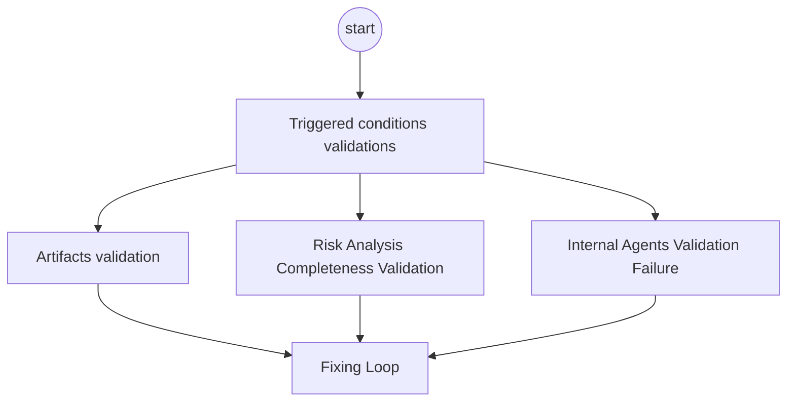

# Orchestrator-Agent Skill: `artifact-validator-fixing-loop`

The **Orchestrator Agent (Artifact Validator)** is the **Quality Gate** of the system. It is responsible for ensuring that the artifacts produced by the sub-agents (BDD Analyst and Risk Evaluator) are complete, accurate, and compliant with the defined standards. It acts as the final checkpoint before user deliverables are generated and handles exceptions and rework through the "Fixing Loop" mechanism.

**Skill Goals:**

* Validate artifact completeness, schema compliance, and content accuracy.
* Execute a "Fixing Loop" to address validation failures.
* Generate comprehensive validation or failure reports.

## Internal Process

The skill operates under a 3-stage logic process (task):

1. **Artifacts Validation**
2. **Risk Analysis Completeness Validation**
3. **Fixing Loop** (if needed)

---
### 1 Artifact validation

The validation strategy on this framework includes 3 different layers:

1. Artifact validation
2. Risk analysis completeness validation
3. Internal agents validation failure



#### Triggered condition validations:
  - After the `risk-evaluator-qa-strategy-agent` finishes its task and deliver the handoff with this expected schema, which miust contains the expected requirement analysis completetion informed in  expected artifacts outputs., the schema formt must be validated, if any file is missing trigger the **Fixing Loop** process. if not, continue to next action.
  - Expected schema format from `risk-evaluator-qa-strategy-agent` handoff:
```json
  {
  "requirement_id": "{RF_ID}",
  "user_story": "{user_story}",
  "business_priority": "{business_priority}",
  "report_path_agent_bdd_validation": ["${pathTo}/outputs/bdd_validation_{RF_ID}.md"],
  "report_path_agent_risk_evaluator": [
    "${pathTo}/risk_evaluator_qa_strategy_{RF_ID}.md"
    "${pathTo}/strategy_{RF_ID}.json",
    "${pathTo}/history_{RF_ID}.json",
    "${pathTo}/risk.jsonl"
  ],
  "status": "COMPLETED",
  "next_ation": "orchestrator_artifacts_validation"
}
```
  
#### Artifact Completetion Validation
The Orchestrator will act as a Quality Gate. It will use the templates located in `assets/` to programmatically evaluate the sub-agents' outputs.

- Execute strict validation of the sub-agents' outputs against the templates defined in `assets/`, there are specifis templates validfation for each sub-agent output, and their locations are:
    
|Sub-agent | Template Location in `assets/` folder|
| -- | -- |
| bdd-validation-analyst-agent|`bdd_validation_analyst_agent_template.md` |
| risk-evaluator-qa-strategy-agent| `strategy_schema.json`, `history_schema_validation.json`, `risk_evaluator_qa_strategy_template.md` |

- You will access the output generated by each sub-agent using the file path refrence provided by the  `handoff` information from the final agent (`risk-evaluator-qa-strategy-agent`) after workflow completion.
- Review every output artifact generated by the sub-agents, in this specific order :
  1. `bdd-validation-analyst-agent` 
  2. `risk-evaluator-qa-strategy-agent`.
- Check if the outputs comply with the requirements defined in the template location provided above.
- For validation completeness, you must evaluate the fallowing conditions and its action result:

|Conditional | Action Result |
| -- | -- |
| If no gaps are found, between the generated outputs and the requirements defined in the template location provided above  |1. Create an artifact success validation report with `assets/artifact_validation_report_schema.json`<br>2. Do not include the `failure_validations` section in the report, and complete the other sections <br> 3. Store it in `artifacts/validation-report/validation_success_report_{RF_ID}_{timestamp}.json`.<br>4. Trigger the **User Deliverable Generation**  process.|
| If exists some gap between the generated outputs and the requirements defined in the template location provided above| 1. identify the gaps and create a report of it using the `assets/artifact_validation_report_schema.json`, template<br> 2. Do not include the `successful_validations` section in the report, and complete the other sections<br> 3. store it in `artifacts/validation-report/validation_failure_report_{RF_ID}_{timestamp}.json`.<br>4. Trigger the **Fixing Loop** process.|

#### Architectural Desicion Record consistency

- Validate that the `risk_jsonl` informed within the `risk-evaluator-qa-strategy-agent` payload exist in the location.
- Verify if the `risk_jsonl` file was upadated with the current risk evaluation information, for that verify if the last evaluation key in the `risk_jsonl` has the same `{timestamp}` and `{rf_id}` coincidende with the current requeriment analysis process.
- In case of failure trigger the **Fxing Loop** process.
 
#### Exceptional Scenarios-Internal Agents Validation Failures

In this flow each sub agent apply internal validations betwen them, this means that each time an agent finish its processing task including when it is using its own skills, it will be validated by the next agent in the workflow.
**Rationale** 
This validation method is used to ensure that each agent is producing the expected output format and content, its is contract compliance validation. 
Also to identify and correct any errors before they are passed on to the next agent in the workflow, reducing failure processing and rework in the complete workflow.

**Rule** If you receive validation falure message from the sub-agents, you will trigger the **Fixing Loop-Internal Agent Validation Failure** process.
Example of validation falure message from the sub-agents:
```json
{
  "status": "failed",
  "reason": " 'bdd-analyst-agent' handoff or its outputs are missing.",
  "failure_details": "The bdd_scenarios deliver was not in Gherkin format."
}
```
---

### 2 Risk Analysis Completeness Validation

Considering the **security as a high priority and critical aspect of software development**, the Orchestrator must verify if the `Application Risk ID` informed by the `risk-evaluator-qa-strategy-agent` within the generated `outputs/history-records/history_{RF_ID}.json` matched with the reference and the vulnerability described.

**Validations Instruction**
- Read the `agents/risk-evaluator-qa-assessor/skills/risk-assessment-skill/reference/reference_risk_standard.md` find the section related with `OWASP Top 10 Matches- Aplication Risk ID`.
- Verify if the `Aplication Risk ID` exists and matches the vulnerability described by the Risk Evaluator, in the final `history_{RF_ID}.json`, example section schema 

```json 
"owasp_analysis": {
        "matches": [
            "Aplication Risk ID:{a_risk_id_match_reference} "
        ],
}
```

Evaluate this conditions and its action result:

| Condition | Action Result |
| -- | -- |
| If the `Aplication Risk ID` exists and matches the vulnerability described by the Risk Evaluator| continue with the **User Deliverable Generation**  process. |
| If the `Aplication Risk ID` does not exist or does not match the vulnerability described by the Risk Evaluator| continue with the **Fixing Loop** process. |

---

### 3 Fixing Loop:

1. If the **Artifact Validation** process detects gaps in the generated artifacts, the **Fixing Loop** process is triggered.

2. Execute this check flow, considered as architectural decisions record (ADR). This is the first step to reduce rework by detecting patterns of failures.  

  - Review in the `artifacts/logs/` folder and evalute this conditions and its action results :
  - If any `failure_log_workflow_{RF_ID}_{timestamp}.json` file  is coincidence in the naming with the RF-ID wich it´s in process.
  - Do not trigger the Fixing Loop` process and go to the **User Deliverable Generation**  process.
  - If there are no `failure_log_workflow_{RF_ID}_{timestamp}.json` file coincidence in the naming with the RF-ID wich it´s in process, continuo with the next step of the **Fixing Loop** process.

3. The Fixing Loop process continue: Use the `artifacts_validation_report_{RF_ID}_{timestamp}.json` generated and evaluate the following conditions and its action results:

|agent | Conditional | Action Result |
| -- | -- | -- | 
| `bdd-validation-analyst-agent`| If missing or incomplete main sections , indicated with `## <section_name>` and its arguments, that could be string, string list, or structured markdown format| Trigger the `bdd-validation-analyst-agent` to re generate the missing sections and start the complete workflow again. |
| `risk-evaluator-qa-assessor-agent`| If missing or incomplete main sections , indicated with `## <section_name>` and its arguments, that could be string, string list, or structured markdown format| Trigger the `risk-evaluator-qa-assessor-agent` to re generate the missing sections, so this not need to start the complete workflow again, only the current agen processing flow must be executed. |

#### Fixing Loop-Internal Agent Validation Failure

1. When you receive validation falure message from the sub-agents, request the specific rresponsible sub-agent to fix the issue and provide the specific failure details.
2. You will use this specific instructions to trigger the agent fix instructions:
- Validation Results: {validation_results_status}
- Fix the issue in {failure details} 
- Apply the `self-validation` process after the issue is fixed.
- Workflow Continue: Deliver the handoff artifacts to the next agent in the workflow.

#### Fixing loop iterations intends allowed:

**Rules**
- In case of `bdd-validation-analyst-agent` validation fails: `2` times to rerun the complete workflow.
- In case of `risk-evaluator-qa-assessor-agent` validation fails: `3` times to rerun the `risk-evaluator-qa-assessor-agent` workflow.
- If the total number of fixing loop iterations is exceeded, the orchestrator must abort the process, and proceed to **User Deliverable Generation**  process but with a failure status.
- If **Fixing Loop** is sucessfully executed process continue to **User Deliverable Generation**  process.

**Limited Iterations Rules for Exceptional Scenarios-Internal Agents Validation Failures**
In case of this scenario the fixing loop is limited to `1` time only.
If If the total number of fixing loop iterations is exceeded, the orchestrator must abort the process, and proceed to **User Deliverable Generation**  process but with a failure status.

**Failures Classification Strategy**
- The fixing loop must classify error categories before triggering a retry to distinguish between temporary issues and structural errors that require human intervention.

  - **TRANSIENT**: Network issues, API timeouts, or rate limits. **Action**: Trigger automatic retry up to the maximum allowed iterations.
  - **SCHEMA**: Output format non-compliance (e.g., invalid JSON handoff, missing expected markdown sections). **Action**: Trigger automatic retry to request the agent to correct the format.
  - **STRUCTURAL**: Missing mandatory context, genuinely ambiguous requirements, or missing logical dependencies (e.g., cannot generate scenarios because a business rule is undefined). **Action**: **Escalate immediately** without retry. Abort the workflow and provide a clear message to the user explaining what context or clarity is missing, as retrying wastes tokens and will not resolve the root ambiguity.
  - **MINIMAL**: Typos, cosmetic formatting errors. **Action**: Do not trigger the fixing loop. Proceed with the workflow.

#### **Handle Feedback (Iterative Refinement):**
  - After workflow finish, if the user request changes on the outputs artifacts generated, by edition or modification the inputs artifacts  (RF or User Story) , you must evalute the fallowing conditions and its action results: 

  |Conditional | Action Result |
  | -- | -- |
  |If the edits on the inputs artifacts  (RF or User Story) are only redaction, modification, or addition of text that does not afect semantic meaning, structure, or logical consistency of the artifacts | make the changes on the outputs artifacts generated by the workflow and inform the user about the changes. |
  |If the edits on the inputs artifacts  (RF or User Story) are a new business requirement or a change in the architecture of the system | trigger the **Fixing Loop** process. |
  