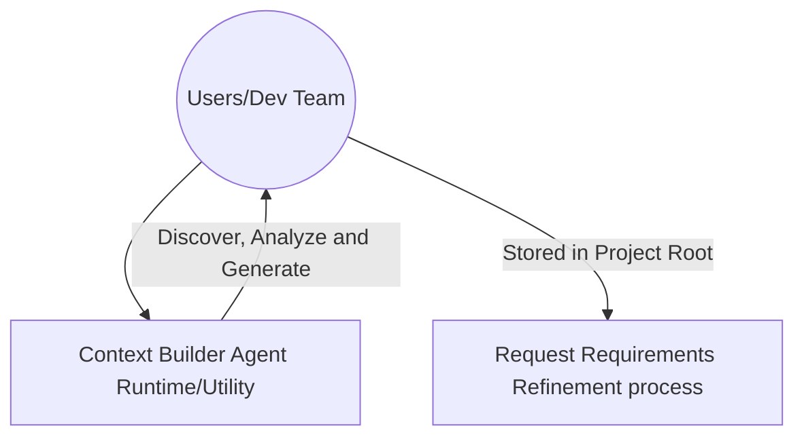

# Orchestrator-Agent Skill: `context-manifest-guidance`

The **Orchestrator Agent (Context Manifesto User Guidance)** is a supportive component of the refinement pipeline. It acts as a **Quality Gate Assistant**, ensuring that the foundation for high-quality requirements analysis is in place before proceeding with BDD scenario generation and risk evaluation.

### Goals

- Detect missing manifest.
- Explain why the manifest is mandatory.
- Reverse-engineer the expected context categories.
- Provide a recommended template structure.
- Suggest enterprise-scale improvements when applicable.

## Trigger Condition

After orchestrator input validation process, in case of missing context manifest, this skill will be triggered.
- Detected absence of `project_context_manifesto.md` in `./project-context/` folder.
- User request guidance or help to create the context manifesto, example prompts (coould be in differents languages):

```txt
"Help me create the context manifesto"
"How do I create the context manifesto?"
"Guide me through the context manifesto creation process"
"I need help with the context manifesto"
```

### Internal Process

The skill operates under a 4-stage logic process:

1. **Explanation of context mandatory requeriment and location**
2. **Reverse-engineer the expected context categories.**
3. **Provide a recommended template structure.**
4. **Enterprise-scale improvements suggestions if applicable.**
5. **Self Validation (Quality Verification)**

---

## 1. Explanation of context mandatory requeriment and location

Inform the user:

The file `project_context_manifesto.md` is a mandatory prerequisite because the refinement pipeline derives architecture-aware BDD scenarios, evidence-based non-functional requirements (NFR) and risk analysis from project context.

Also inform **file location and naming convention**:

- The file must be stored in the `./project-context/` folder of the project root.
- The file name must be `project_context_manifesto.md`. 
- If a custom name is used, it must be updated consistently across all orchestrator and sub-agent configurations.

## 2. Reverse-engineer the expected context categories

Based on the expected refinement workflow, request the following categories:

| Category                   | Why It Matters                     |
| -------------------------- | ---------------------------------- |
| Metadata (Staleness Check) | Warns user if context is outdated  |
| System Overview            | Business domain and scope          |
| Technical Architecture     | Interface and integration analysis |
| Core Business Flows        | BDD scenario generation            |
| Security Baselines         | Threat-oriented NFR extraction     |
| Performance Expectations   | Performance NFR derivation         |
| Compliance Requirements    | Regulatory and governance NFRs     |
| Accessibility/UX Standards | Usability and accessibility NFRs   |

## 3. Provide a recommended template structure.

Suggest to the user to create the context manifesto file with the following sections, futhermore it can include more sections based on the project needs, but always recommend keeping the file organized and easy to read, especially in Markdown format and longer than 500 code lines to ensure:
- Context enrichment.
- Main Project Context categories.
- Context Organization and easy to read.
- Low Token consumption for the refinement process.

**Sections Example:**

```markdown
---
version: 1.0.0
last_updated: YYYY-MM-DD
---
# Project Context Manifesto: [PROJECT_NAME]

**Purpose:** This document provides comprehensive context for requirements analysis, BDD scenario generation, and risk-based test strategy development.

## 1. System Overview
- [Describe the system's purpose, business domain, products/services descriptions, and key capabilities. If is possible, expected final users descriptions (roles, behaviors, expectations, etc)]

## 2. Technical Architecture
- [Component architecture]
- [Key interfaces and integration points]
- [Technology stack]

## 3. Core Business Flows
- [Main user journeys]
- [Critical business rules]

## 4. Security Baselines
- [Authentication and authorization mechanisms]
- [Data protection requirements]
- [Threat model overview]

## 5. Performance Expectations
- [Response time targets]
- [Scalability requirements]
- [Throughput expectations]

## 6. Compliance Requirements
- [Applicable regulations and standards]
- [Governance requirements]
- [Data residency requirements]

## 7. Accessibility/UX Standards
- [Accessibility standards (WCAG, etc.)]
- [Usability requirements]
- [Internationalization requirements]

## 8. QA & Compliance Baselines
- [Security baselines]
- [Performance expectations]
- [Compliance requirements]
- [Accessibility/UX standards]

```

## 4. Enterprise-scale improvements suggestions if applicable.

Amplify user guidance with recommendation for the creation of an automated tool for the creation of context manifesto, in case of the solution uss intends to be used across multiple projects in the same organization.

### Specific Recommendation for Enterprise Scale Projects

For organizations with multiple repositories or product teams, consider  automating context collection with a dedicated `context-builder-agent` that generates standardized `project_context_manifesto.md` files from **local context**, repository documentation and architectural assets.

**Context Builder Agent Suggestions Goals:**

- Discover context main information for requeriments refinement process, for that analyze:
    - repository structure
    - documentation
    - architecture files
    - conventions
    - organizational rules
- Use discovered information to Generate a standardized `project_context_manifesto.md` file.

### Benefits

- Consistent context quality across projects.
- Reduced manual onboarding effort.
- Better security and compliance coverage.
- Standardized NFR extraction.
- Lower long-term maintenance cost.
- Allows reuse across multiple projects.
- Independent evolution of the context builder.
- Supports enterprise-scale onboarding later.

### Trade-offs

* Higher implementation complexity.
* Requires repository analysis capabilities.
* Introduces additional preprocessing steps.
* Needs governance for context normalization.

### Concern Separation from runtime refinement process

**Strongly recommend**
- Use the Context Builder Agent as a separate utility from runtime refinement process.
- Keeps the current orchestrator and its sub-agents deterministic in requirements analyzer logic.
- Avoid embedding in Orchestrator to control:
    - Mixed responsibilities.
    - Harder testing.
    - Higher token consumption.
    - More failure modes.
    - Less predictable execution.
- Avoids repository-scanning complexity in the runtime workflow.



## 5. Self Validation (Quality Verification)

- [ ] Verify the missing manifest was explicitly detected.
- [ ] Verify the root-directory naming convention was explained.
- [ ] Verify all required context categories were requested, including metadata for freshness check.
- [ ] Verify the template includes architecture, business flows, and QA baselines.
- [ ] Verify the enterprise recommendation is only presented as an optional future improvement.

---

## Constraints

| Constraint Type | Rule                                                           |
| --------------- | -------------------------------------------------------------- |
| Must            | Request project_context_manifesto.md when missing.             |
| Must            | Explain the `<./project-context/project_context_manifesto.md>` directory location and file naming convention.                  |
| Must            | Provide a template structure.                                  |
| Should          | Explain why each context category improves refinement quality. |
| Could           | Suggest enterprise automation through a Context Builder Agent. |
| Won't           | Generate the manifest automatically.                           |
| Won't           | Scan repositories or external documentation.                   |
| Won't           | Modify orchestrator configuration files.                       |

## Output

### Final Output Artifact: User Information Message

The skill generates a user informative and readable message containing guidance for the creation of the `project_context_manifesto.md` file. 

Within the message provide the content grouped in sections, like it is shown in the example below, also include the exact **recommended template structure** in the message.

**EXAMPLE User Guidance Information Message:**

```txt
🤖 Hello, I am the `orchestrator agent`, your `Requirements Analyzer`. I detected that the 
📄 `project_context_manifesto.md` is missing.

I need this file to continue with the refinement process.

Please, create the `project_context_manifesto.md` file in the `project-context` folder of the project root.

{Explanation of context mandatory requeriment and location}

{Reverse-engineer the expected context categories}

{Provide a recommended template structure.}

If your organization manages multiple projects, consider:
{Enterprise-scale improvements suggestions if applicable.}

After creating the file, and provide it in root project directory you can trigger the **requirements refinement** process.

I will be waiting for you!

```
